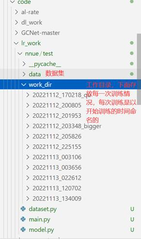
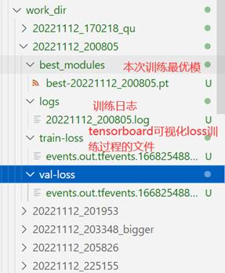

# 文件结构

Main.py  训练的主要函数

Model.py 模型定义

Dataset.py 定义数据接口

Data文件夹：主要存放数据

Work_dir文件夹 : 存放的训练日志





# 主要环境

```
torch==1.11
torchvision
numpy
tensorboard
time
```

Python3.8

pytorch1.11，直接pip即可

安装命令：

```
conda create --name nnue-env python=3.8
	conda activate nnue-env(linux下) 
or 	activate nnue-env           (windows下)
pip install numpy
pip install torch==1.11
pip install torchvision
pip install tensorboard
pip install time
pip install argparse logging
pip install argparse argparse
pip install matplotlib
```

# 训练命令

先激活环境：

```shell
conda activate nnue-env
```

加上 --cpu是指在cpu端训练。

```shell
python main.py --cpu
```

使用 gpu 从上一次训练的模型开始进行训练，注意配置好best_modules_path的路径

```shell
python main.py --from_checkpoint
```

另外，若是使用tensorboard可视化loss训练情况，可以使用下述命令：

```
sanmill-nnue-pytorch\work_dir\YYYYMMDD_HHMMSS>tensorboard --logdir .
```

